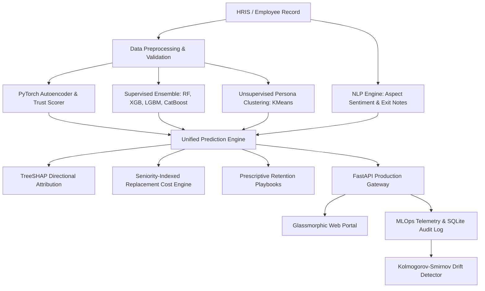

# System Architecture & Data Flow Specification

## 1. Overview
The **Enterprise Employee Attrition Prediction Service** is a modular, production-grade intelligence platform engineered for proactive workforce retention, risk diagnostics, prescriptive intervention planning, and financial cost-of-turnover optimization.

---

## 2. Multi-Tier Processing Engine

### Tier 1: Data Trust & Anomaly Scoring (PyTorch Autoencoder)
- **Deep Tabular Autoencoder & VAE**: Projects numerical employee vectors into latent space.
- **Data Trust Score**: Inversely proportional to reconstruction MSE. High reconstruction error flags out-of-distribution profiles (e.g., data corruption, extreme outliers), signaling lower model confidence.

### Tier 2: Supervised Predictive Ensemble
- **Algorithms**: Random Forest, XGBoost, LightGBM, CatBoost, Calibrated Logistic Regression.
- **Ensemble Methodology**: Soft probability averaging with Platt-calibrated outputs to ensure accurate risk probabilities.

### Tier 3: Behavioral Persona Clustering
- **KMeans Persona Segmentation**: Clusters employees into distinct behavioral archetypes:
  - *High-Velocity Early Talent*
  - *Overworked Mid-Career Stagnant*
  - *Tenured Legacy Anchors*
  - *Disengaged Flight Risks*

### Tier 4: NLP Exit & Pulse Survey Engine
- Analyzes unstructured survey text across key sentiment facets: *Compensation*, *Leadership*, *Work-Life Balance*, and *Career Growth*.

---

## 3. Explainability & Financial Models

- **SHAP (SHapley Additive exPlanations)**: Computes exact directional feature contributions for each individual prediction, pinpointing the precise levers causing attrition risk.
- **Turnover Financial Cost Model**: Calculates replacement expenses including recruitment, onboarding, training, vacancy lost productivity, and severance indexed to employee seniority tier.
- **Prescriptive Retention Playbooks**: Maps SHAP risk drivers and behavioral persona to actionable, ROI-ranked retention strategies.

---

## 4. MLOps Monitoring & Drift Detection

- **SQLite Audit Logging**: Every inference request, input feature payload, confidence score, and latency is recorded.
- **Kolmogorov-Smirnov (KS) Test**: Compares baseline training distributions against streaming inference distributions for continuous feature drift alerting.
